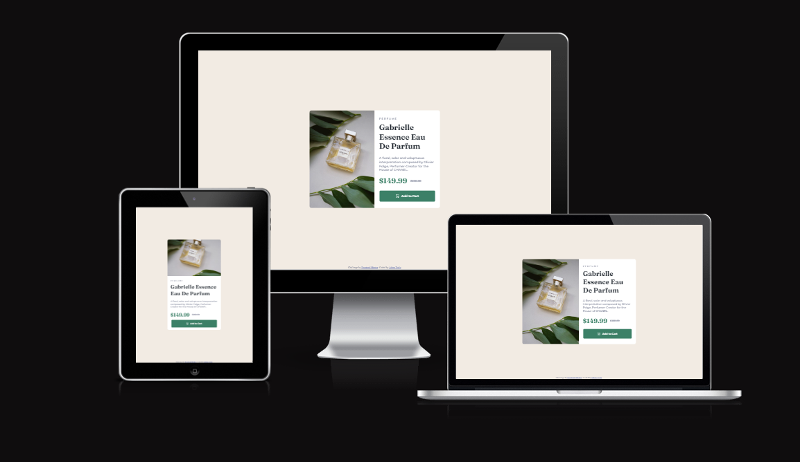

# Frontend Mentor - Product preview card component

Dies ist eine Lösung für die [Product preview card component challenge on Frontend Mentor](https://www.frontendmentor.io/challenges/product-preview-card-component-GO7UmttRfa). Frontend-Mentor-Herausforderungen helfen Ihnen, Ihre Programmierfähigkeiten zu verbessern, indem Sie realistische Projekte erstellen.

## Inhaltsverzeichnis

- [Übersicht](#übersicht)
  - [Screenshot](#screenshot)
  - [Links](#links)
- [Mein Prozess](#mein-prozess)
  - [Erstellt mit](#erstellt-mit)
  - [Was ich gelernt habe](#was-ich-gelernt-habe)
  - [Fortsetzung der Entwicklung](#weiterentwicklung)
- [Autor](#autor)

## Überblick

### Screenshot

### Links

- Lösungs-URL: [Github-Lösungen](https://github.com/Adem-Tozlu/Frontend-Mentor-Results-summary-component)
- Live-Site-URL: [Website-QR-Code](https://frontend-mentor-preview-card-component.vercel.app/)

## Mein Prozess

### Erstellt mit

- Semantisches HTML5-Markup
- Benutzerdefinierte CSS-Eigenschaften
- Flexbox
- Mobile-design
- Grid

## Autor

- Website - [Github](https://github.com/Adem-Tozlu)
- Frontend-Mentor – [@Adem-Tozlu](https://www.frontendmentor.io/profile/Adem-Tozlu)
- Linkedin - [@Adem-Tozlu](https://www.linkedin.com/in/adem-tozlu-8906b52a5)